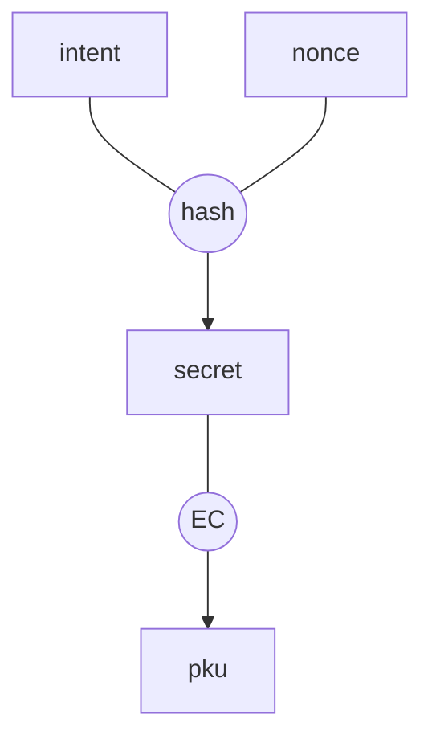

#!/usr/bin/perl

=pod
 ```mermaid
 flowchart LR
  msg & nonce --- kh((hash)) --> secret --- EC((EC)) --> pku 
```

## key generation from nonce

```mermaid
 flowchart TD
  intent & nonce --- KH((hash)) --> secret --- ec((EC)) --> pku 
```